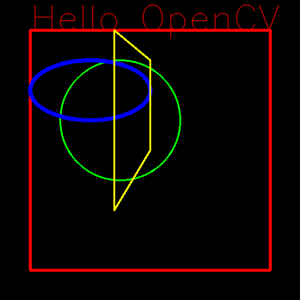

# 👁️ Basics of Computer Vision (Lab Workshop)

## 📝 Project Overview
This repository contains a comprehensive **Computer Vision Lab** (`19bci7072_CSE4006_LAB_3.ipynb`) focused on fundamental image processing techniques using **OpenCV** and **Python**. It serves as a practical guide to understanding how machines perceive and manipulate visual data.

## ✨ Key Concepts Covered
*   **Image I/O**: Reading and displaying multiple specific images (e.g., `beach.jpg`, `brain_ct.jpg`).
*   **Drawing Operations**: Creating synthetic images with geometric shapes (Lines, Circles, Rectangles) and text using OpenCV.
*   **Morphological Transformations**:
    *   **Erosion & Dilation**: Removing noise and strengthening features.
    *   **Opening & Closing**: Handling internal/external noise in binary images.
    *   **Morphological Gradient**: Edge detection.
*   **Object Detection**:
    *   **Face Detection**: Implementing **Haar Cascades** (`haarcascade_frontalface_default.xml`) to detect faces in images.
    *   **Eye Detection**: Using pre-trained XML classifiers to locate eyes.

## 📂 Files Included
```text
.
├── 📄 19bci7072_CSE4006_LAB_3.ipynb  # Main Jupyter Notebook with code and outputs
├── 📂 Assets                         # (Images used in the lab)
│   ├── beach.jpg
│   ├── brain_ct.jpg
│   ├── elephant.jpeg
│   ├── flower1.jpg
│   ├── monkey1.JPG
│   └── rupiah.jpg
├── 📄 haarcascade_frontalface_default.xml # Face detection model
├── 📄 haarcascade_eye.xml            # Eye detection model
└── 📄 README.md                      # Project documentation
```

## 🛠️ Prerequisites & Setup
1.  **Install Python** (3.7+)
2.  **Install Dependencies**:
    ```bash
    pip install -r requirements.txt
    ```
    *   `opencv-python` (cv2)
    *   `matplotlib`
    *   `numpy`
    *   `notebook`

## 🚀 Usage
1.  **Launch Jupyter Notebook**:
    ```bash
    jupyter notebook
    ```
2.  Open `19bci7072_CSE4006_LAB_3.ipynb`.
3.  Run cells sequentially to visualize image transformations and detection results.

## 🖼️ Example Output
### Drawing Operations


### Morphological Operations


## 🤝 Credits
*   **Author**: Karthik Kumar Reddy Kota (Reg No: 19bci7072)
*   **Course**: CSE4006 - Computer Vision Lab
